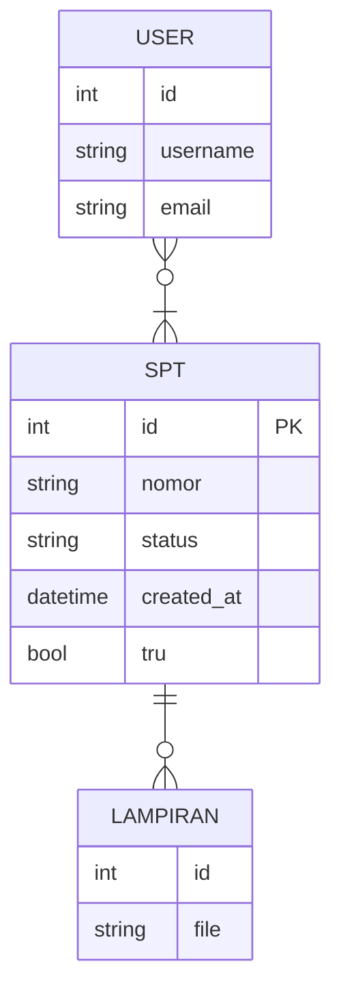

```mermaid
erDiagram

    USER {
        int id
        string username
        string email
    }

    SPT {
        int id PK
        string nomor
        string status
        datetime created_at
        bool tru
    }

    LAMPIRAN {
        int id
        string file
    }

    USER }o--|{ SPT : ""
    SPT ||--o{ LAMPIRAN : ""
```