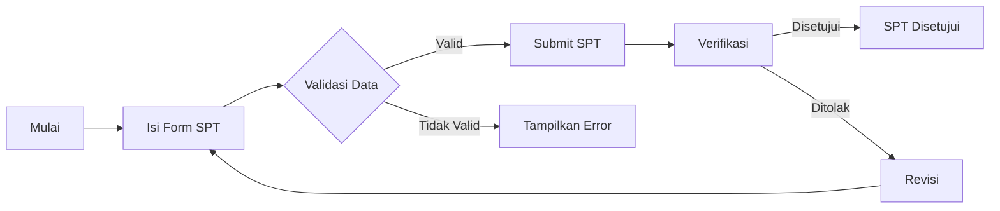

```mermaid
flowchart LR    

    A[Mulai] --> B[Isi Form SPT]

    B --> C{Validasi Data}

    C -->|Valid| D[Submit SPT]

    C -->|Tidak Valid| E[Tampilkan Error]

    D --> F[Verifikasi]

    F -->|Disetujui| G[SPT Disetujui]

    F -->|Ditolak| H[Revisi]

    H --> B
```