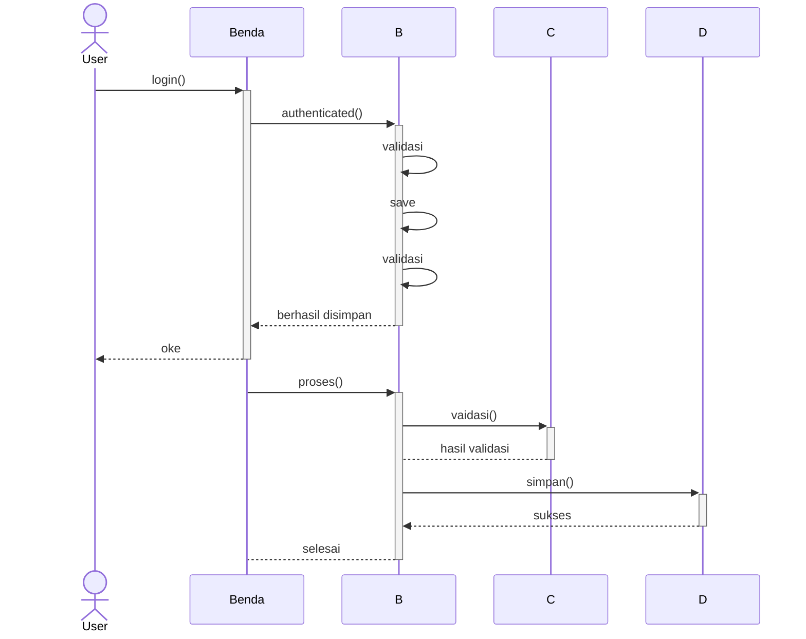

```mermaid
sequenceDiagram
actor U as User
participant A as Benda
participant B
participant C 
participant D

U ->>+ A: login()

A ->>+ B: authenticated()
B ->> B: validasi
B ->> B: save
B ->> B: validasi
B -->>- A: berhasil disimpan

A -->>-U: oke
A ->>+ B: proses()
B ->>+ C: vaidasi()
C -->- B: hasil validasi
B ->>+ D: simpan()
D -->>- B: sukses
B -->- A: selesai

```