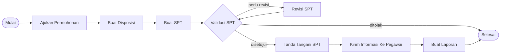

```mermaid
flowchart LR

    start([Mulai])
    ajukan_permohonan[Ajukan Permohonan]
    buat_spt[Buat SPT]
    buat_disposisi[Buat Disposisi]
    validasi_spt{Validasi SPT} 
    revisi_spt[Revisi SPT]
    tanda_tangani_spt[Tanda Tangani SPT]
    kirim_informasi_ke_pegawai[Kirim Informasi Ke Pegawai]
    buat_laporan[Buat Laporan]

    selesai([Selesai])

    start --> ajukan_permohonan
    ajukan_permohonan --> buat_disposisi
    buat_disposisi --> buat_spt
    buat_spt --> validasi_spt
    validasi_spt -->|perlu revisi| revisi_spt
    validasi_spt -->|ditolak| selesai
    revisi_spt --> validasi_spt
    validasi_spt -->|disetujui| tanda_tangani_spt
    tanda_tangani_spt --> kirim_informasi_ke_pegawai
    kirim_informasi_ke_pegawai --> buat_laporan

    buat_laporan --> selesai
```