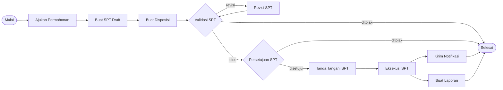

```mermaid
flowchart LR

    start([Mulai])
    ajukan_permohonan[Ajukan Permohonan]
    buat_spt[Buat SPT Draft]
    buat_disposisi[Buat Disposisi]
    validasi_spt{Validasi SPT}
    revisi_spt[Revisi SPT]
    persetujuan_spt{Persetujuan SPT}
    tanda_tangani_spt[Tanda Tangani SPT]
    eksekusi_spt[Eksekusi SPT]
    kirim_notifikasi[Kirim Notifikasi]
    buat_laporan[Buat Laporan]
    selesai([Selesai])

    start --> ajukan_permohonan
    ajukan_permohonan --> buat_spt

    %% DISPOSISI DITAMBAHKAN DI SINI
    buat_spt --> buat_disposisi
    buat_disposisi --> validasi_spt

    validasi_spt -->|revisi| revisi_spt
    revisi_spt --> validasi_spt
    validasi_spt -->|ditolak| selesai
    validasi_spt -->|lolos| persetujuan_spt

    persetujuan_spt -->|disetujui| tanda_tangani_spt
    persetujuan_spt -->|ditolak| selesai

    tanda_tangani_spt --> eksekusi_spt
    eksekusi_spt --> kirim_notifikasi
    eksekusi_spt --> buat_laporan
    kirim_notifikasi --> selesai
    buat_laporan --> selesai
```