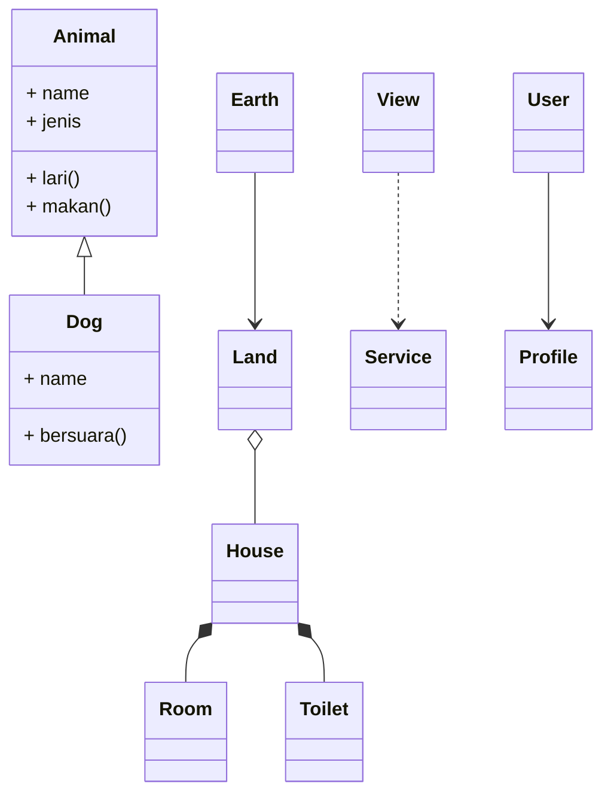

```mermaid
classDiagram

class Animal {
    + name
    + jenis
    
    + lari()
    + makan()
}

class Dog {
    + name
    + bersuara()
}

class House {}
class Room {}
class Toilet {}
class Land {}
class Earth {}

class View {}
class Service {}

class User {}
class Profile {}

User --> Profile

View ..> Service

Earth --> Land
Land o-- House

House *-- Room
House *-- Toilet

Animal <|-- Dog
```