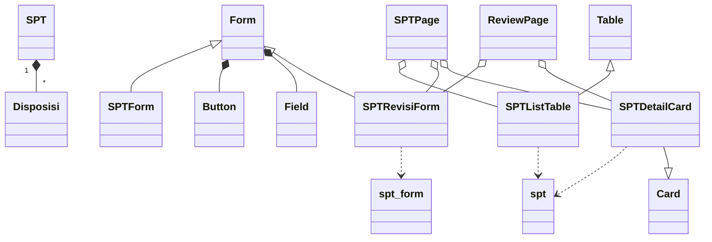

```mermaid
classDiagram

class Form {}
class Field {}
class Button {}
class Table {}
class Card {}

class Disposisi{}


class SPTRevisiForm {}
class SPTListTable {}
class SPTDetailCard {}

class SPTPage {}
class ReviewPage {}
class SPTForm {}

Form <|-- SPTForm

SPTPage o-- SPTListTable
SPTPage o-- SPTRevisiForm
SPTPage o-- SPTDetailCard

ReviewPage o-- SPTRevisiForm
ReviewPage o-- SPTDetailCard

SPTListTable ..> spt
SPTDetailCard ..> spt
SPTRevisiForm ..> spt_form


SPTDetailCard --|> Card

Form *-- Button
Form *-- Field

Form <|-- SPTRevisiForm
Table <|-- SPTListTable

%% relasi data
SPT "1" *-- "*" Disposisi
```