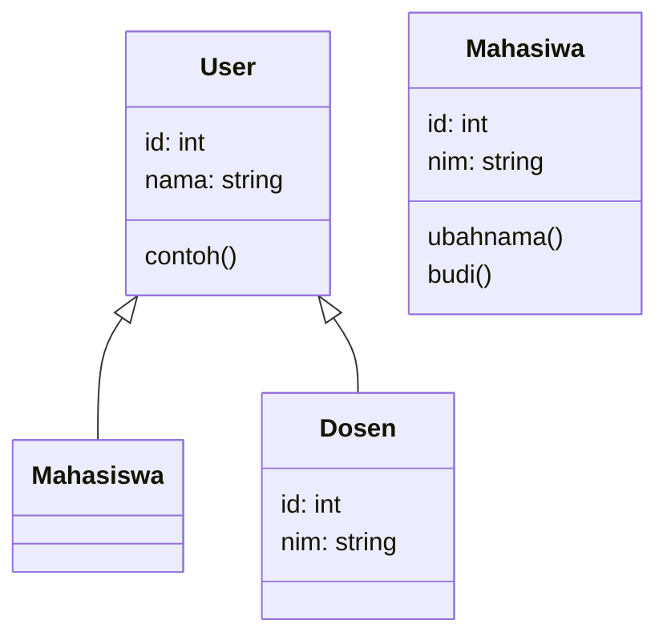

```mermaid
classDiagram
class User {
    id: int
    nama: string
    contoh()
}

class Mahasiwa {
    ubahnama()
    id: int
    budi()
    nim: string 
}

class Dosen {
    id: int
    nim: string
}

User <|-- Mahasiswa
User <|-- Dosen

```