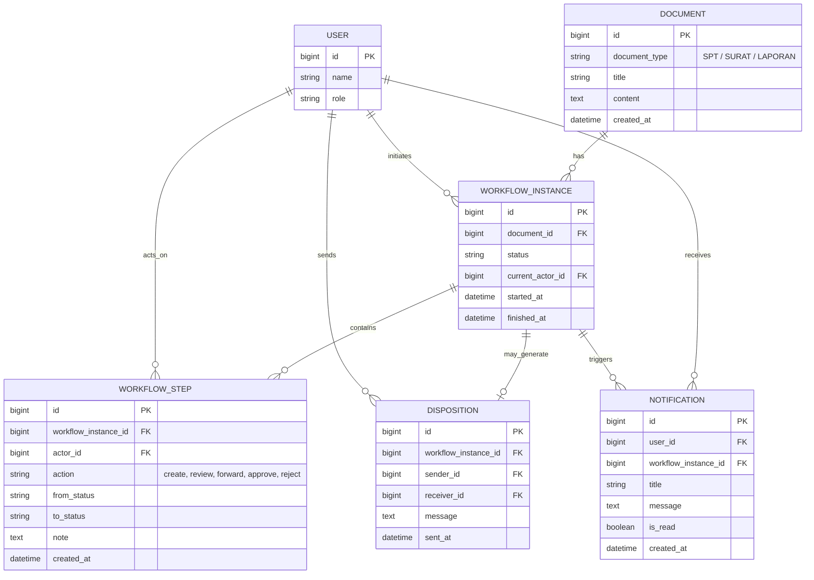

```mermaid
erDiagram

    USER ||--o{ WORKFLOW_INSTANCE : initiates
    USER ||--o{ WORKFLOW_STEP : acts_on
    USER ||--o{ DISPOSITION : sends

    DOCUMENT ||--o{ WORKFLOW_INSTANCE : has
    WORKFLOW_INSTANCE ||--o{ WORKFLOW_STEP : contains
    WORKFLOW_INSTANCE ||--o| DISPOSITION : may_generate

    WORKFLOW_INSTANCE ||--o{ NOTIFICATION : triggers
    USER ||--o{ NOTIFICATION : receives

    DOCUMENT {
        bigint id PK
        string document_type  "SPT / SURAT / LAPORAN"
        string title
        text content
        datetime created_at
    }

    WORKFLOW_INSTANCE {
        bigint id PK
        bigint document_id FK
        string status
        bigint current_actor_id FK
        datetime started_at
        datetime finished_at
    }

    WORKFLOW_STEP {
        bigint id PK
        bigint workflow_instance_id FK
        bigint actor_id FK
        string action  "create, review, forward, approve, reject"
        string from_status
        string to_status
        text note
        datetime created_at
    }

    DISPOSITION {
        bigint id PK
        bigint workflow_instance_id FK
        bigint sender_id FK
        bigint receiver_id FK
        text message
        datetime sent_at
    }

    NOTIFICATION {
        bigint id PK
        bigint user_id FK
        bigint workflow_instance_id FK
        string title
        text message
        boolean is_read
        datetime created_at
    }

    USER {
        bigint id PK
        string name
        string role
    }
```