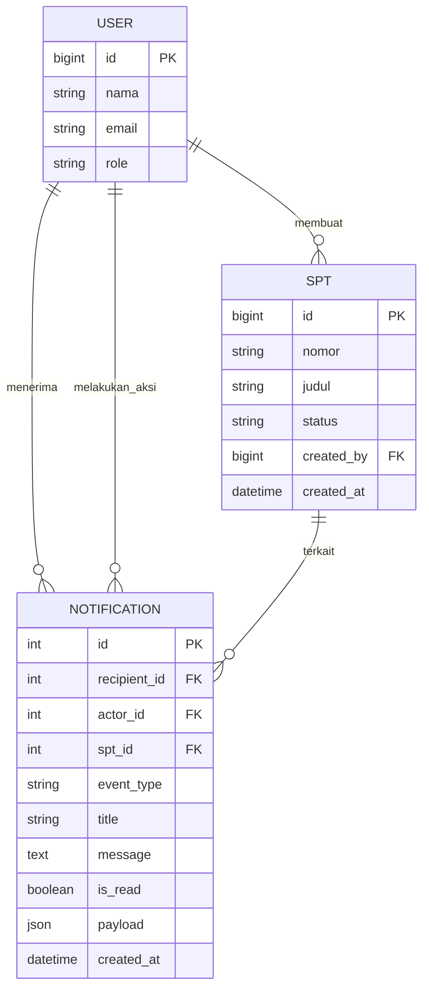

```mermaid
erDiagram

    USER {
        bigint id PK
        string nama
        string email
        string role
    }

    SPT {
        bigint id PK
        string nomor
        string judul
        string status
        bigint created_by FK
        datetime created_at
    }

    NOTIFICATION {
        int id PK
        int recipient_id FK
        int actor_id FK
        int spt_id FK
        string event_type
        string title
        text message
        boolean is_read
        json payload
        datetime created_at
    }

    USER ||--o{ SPT : membuat

    USER ||--o{ NOTIFICATION : menerima
    USER ||--o{ NOTIFICATION : melakukan_aksi

    SPT ||--o{ NOTIFICATION : terkait
```