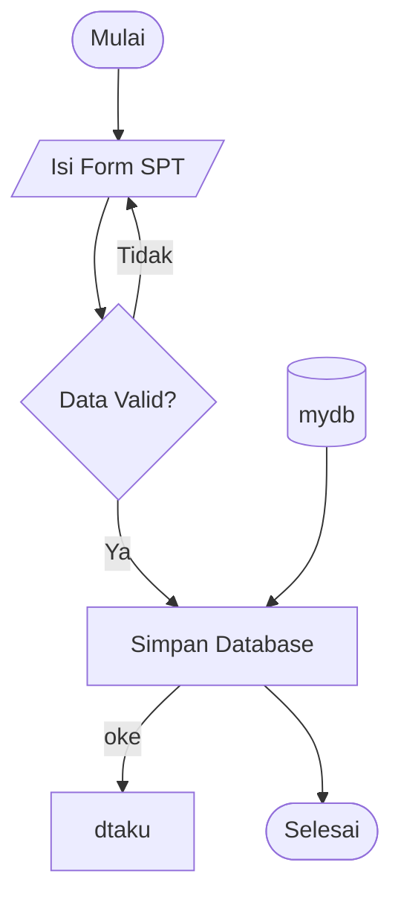

```mermaid
flowchart TD

    start([Mulai])

    input_form[/Isi Form SPT/]

    validasi{Data Valid?}

    simpan[Simpan Database]
    selesai([Selesai])

    db[(mydb)]


    start --> input_form
    input_form --> validasi

    validasi -->|Ya| simpan
    db --> simpan

    simpan -->|oke| dtaku

    validasi -->|Tidak| input_form

    simpan --> selesai
```