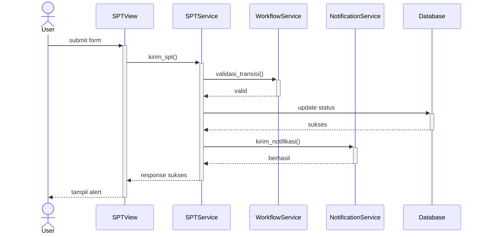

```mermaid
sequenceDiagram
    actor User

    participant View as SPTView
    participant SPT as SPTService
    participant Workflow as WorkflowService
    participant Notification as NotificationService
    participant DB as Database

    User->>+View: submit form

    View->>+SPT: kirim_spt()

    SPT->>+Workflow: validasi_transisi()
    Workflow-->>-SPT: valid

    SPT->>+DB: update status
    DB-->>-SPT: sukses

    SPT->>+Notification: kirim_notifikasi()
    Notification-->>-SPT: berhasil

    SPT-->>-View: response sukses

    View-->>-User: tampil alert
```