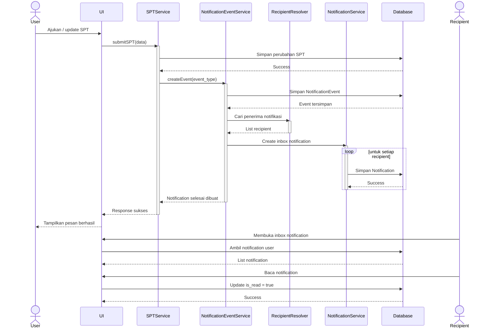

```mermaid
sequenceDiagram
    actor User
    participant UI
    participant SPTService
    participant NotificationEventService
    participant RecipientResolver
    participant NotificationService
    participant Database
    actor Recipient

    User->>UI: Ajukan / update SPT
    UI->>SPTService: submitSPT(data)

    activate SPTService

        SPTService->>Database: Simpan perubahan SPT
        Database-->>SPTService: Success

        SPTService->>NotificationEventService: createEvent(event_type)

        activate NotificationEventService

            NotificationEventService->>Database: Simpan NotificationEvent
            Database-->>NotificationEventService: Event tersimpan

            NotificationEventService->>RecipientResolver: Cari penerima notifikasi

            activate RecipientResolver
                RecipientResolver-->>NotificationEventService: List recipient
                deactivate RecipientResolver

                NotificationEventService->>NotificationService: Create inbox notification

                activate NotificationService

                    loop untuk setiap recipient
                        NotificationService->>Database: Simpan Notification
                        Database-->>NotificationService: Success
                    end

                deactivate NotificationService

    NotificationEventService-->>SPTService: Notification selesai dibuat
    deactivate NotificationEventService

    SPTService-->>UI: Response sukses
    deactivate SPTService

    UI-->>User: Tampilkan pesan berhasil

    Recipient->>UI: Membuka inbox notification
    UI->>Database: Ambil notification user
    Database-->>UI: List notification

    Recipient->>UI: Baca notification
    UI->>Database: Update is_read = true
    Database-->>UI: Success
```