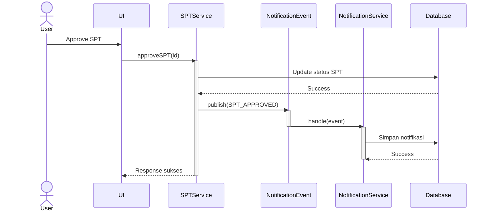

```mermaid
sequenceDiagram
    actor User
    participant UI
    participant SPTService
    participant NotificationEvent
    participant NotificationService
    participant Database

    User->>UI: Approve SPT
    UI->>SPTService: approveSPT(id)

    activate SPTService
    SPTService->>Database: Update status SPT
    Database-->>SPTService: Success

    SPTService->>NotificationEvent: publish(SPT_APPROVED)

    activate NotificationEvent
    NotificationEvent->>NotificationService: handle(event)
    deactivate NotificationEvent

    activate NotificationService
    NotificationService->>Database: Simpan notifikasi
    Database-->>NotificationService: Success
    deactivate NotificationService

    SPTService-->>UI: Response sukses
    deactivate SPTService
```