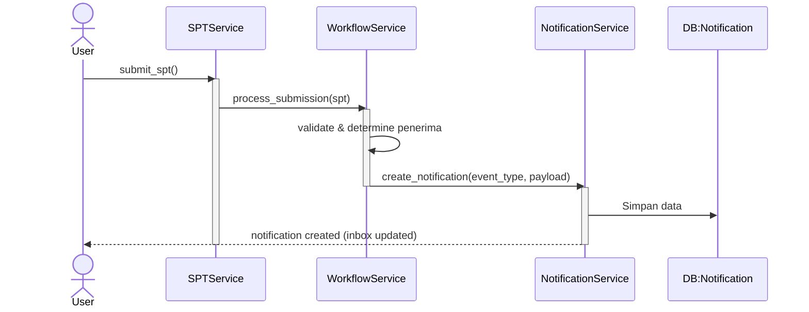

```mermaid
sequenceDiagram
    actor User

    participant SPTService
    participant WorkflowService
    participant NotificationService
    participant Notification as DB:Notification

    User->>SPTService: submit_spt()

    activate SPTService
    SPTService->>WorkflowService: process_submission(spt)
    activate WorkflowService

    WorkflowService->>WorkflowService: validate & determine penerima

    WorkflowService->>NotificationService: create_notification(event_type, payload)

    deactivate WorkflowService
    activate NotificationService

    NotificationService->>Notification: Simpan data

    NotificationService-->>User: notification created (inbox updated)

    deactivate NotificationService
    deactivate SPTService
```