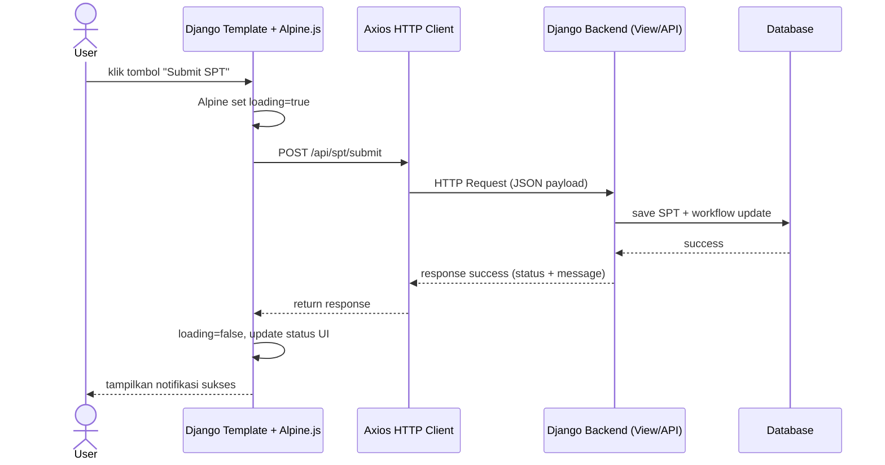

```mermaid
sequenceDiagram
    actor User
    participant UI as Django Template + Alpine.js
    participant Axios as Axios HTTP Client
    participant API as Django Backend (View/API)
    participant DB as Database

    User->>UI: klik tombol "Submit SPT"

    UI->>UI: Alpine set loading=true

    UI->>Axios: POST /api/spt/submit

    Axios->>API: HTTP Request (JSON payload)

    API->>DB: save SPT + workflow update

    DB-->>API: success

    API-->>Axios: response success (status + message)

    Axios-->>UI: return response

    UI->>UI: loading=false, update status UI

    UI-->>User: tampilkan notifikasi sukses
```