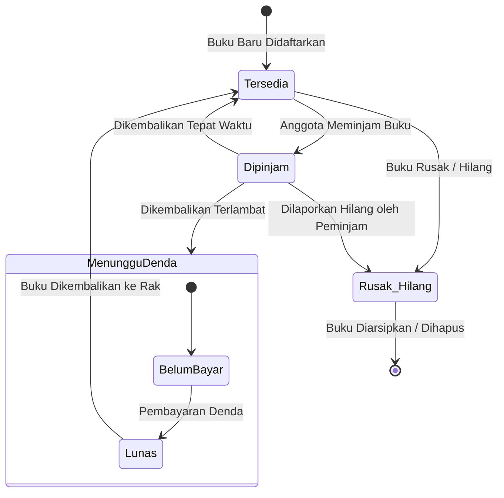

```mermaid
stateDiagram-v2
    [*] --> Tersedia : Buku Baru Didaftarkan

    Tersedia --> Dipinjam : Anggota Meminjam Buku
    
    Dipinjam --> MenungguDenda : Dikembalikan Terlambat
    Dipinjam --> Tersedia : Dikembalikan Tepat Waktu

    state MenungguDenda {
        [*] --> BelumBayar
        BelumBayar --> Lunas : Pembayaran Denda
    }

    Lunas --> Tersedia : Buku Dikembalikan ke Rak
    
    Tersedia --> Rusak_Hilang : Buku Rusak / Hilang
    Dipinjam --> Rusak_Hilang : Dilaporkan Hilang oleh Peminjam
    
    Rusak_Hilang --> [*] : Buku Diarsipkan / Dihapus

```